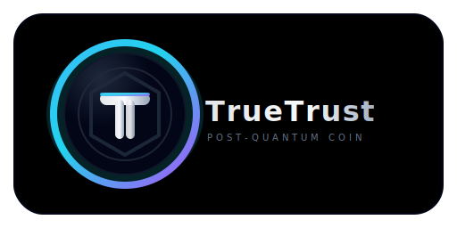

<p align="center">
  
</p>

# True Trust Protocol

[](https://www.rust-lang.org/)
[](LICENSE)
[](https://csrc.nist.gov/projects/post-quantum-cryptography)
[]()

**Post-quantum blockchain with privacy-preserving transactions.**

## Overview

True Trust Protocol is a Layer-1 blockchain implementing NIST-standardized post-quantum cryptography for all security-critical operations. The system provides transaction privacy through STARK zero-knowledge proofs and stealth addresses.

## Key Features

| Component          | Technology                         | Status         |
|--------------------|------------------------------------|----------------|
| Digital Signatures | Falcon-512 (NIST PQC)              | ✅ Implemented |
| Key Encapsulation  | Kyber-768 / ML-KEM (NIST PQC)      | ✅ Implemented |
| Zero-Knowledge     | STARK (Winterfell)                 | ✅ Implemented |
| Privacy            | Stealth Addresses + Encrypted Amt  | ✅ Implemented |
| Consensus          | RTT + Stake + Quality Weighted     | ✅ Implemented |
| P2P Network        | Hybrid PQ Encryption               | ✅ Implemented |

## Performance (Measured)

| Operation            | Time   | Throughput |
|----------------------|--------|------------|
| Falcon-512 Sign      | 203 μs | 4,931/s    |
| Falcon-512 Verify    | 37 μs  | 27,082/s   |
| Kyber-768 Encaps     | 33 μs  | 29,916/s   |
| Kyber-768 Decaps     | 35 μs  | 28,960/s   |
| Full TX (Sign + KEM) | 313 μs | 3,191/s    |

*Benchmarks on AMD Ryzen 3 5300U*

## Quick Start

```bash
# Build
cargo build --release

# Run tests
cargo test --release

# Run benchmarks
cargo run --release --example benchmarks
```

## Documentation

- [**WHITEPAPER.md**](WHITEPAPER.md) — Technical specification and architecture
- [**tt_node/src/README.md**](tt_node/src/README.md) — Source code structure

## Project Structure

```
True-Trust-Protocol/
├── tt_node/              # Main node implementation
│   ├── src/
│   │   ├── crypto/       # Cryptographic primitives
│   │   ├── p2p/          # Peer-to-peer networking
│   │   ├── rpc/          # RPC server
│   │   └── wallet/       # Wallet implementation
│   ├── tests/            # Integration tests
│   └── examples/         # Demos and benchmarks
└── falcon_seeded/        # Deterministic Falcon keygen
```

## Security

- All cryptographic primitives are NIST PQC standardized or widely audited
- 126 automated tests covering security-critical paths
- Zeroization of sensitive data in memory
- No unsafe Rust in cryptographic code paths

## License

Apache 2.0

## Acknowledgments

- [pqcrypto](https://github.com/rustpq/pqcrypto) — Rust PQC bindings
- [Winterfell](https://github.com/novifinancial/winterfell) — STARK prover
- [NLnet Foundation](https://nlnet.nl/) — Funding support
